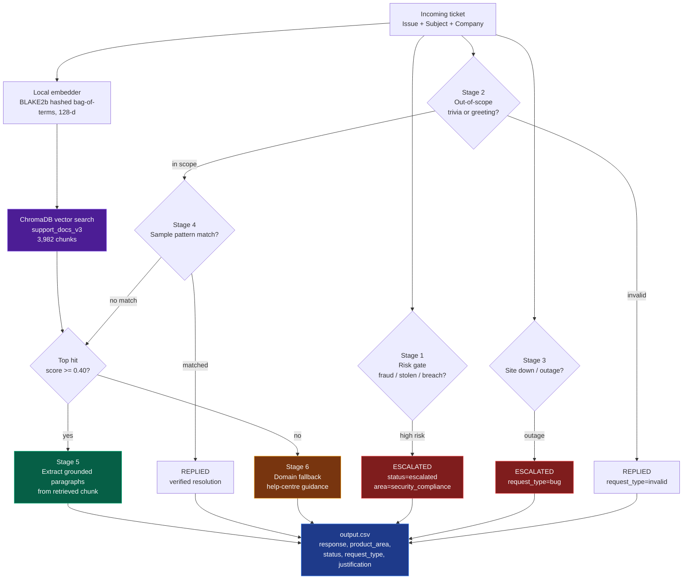
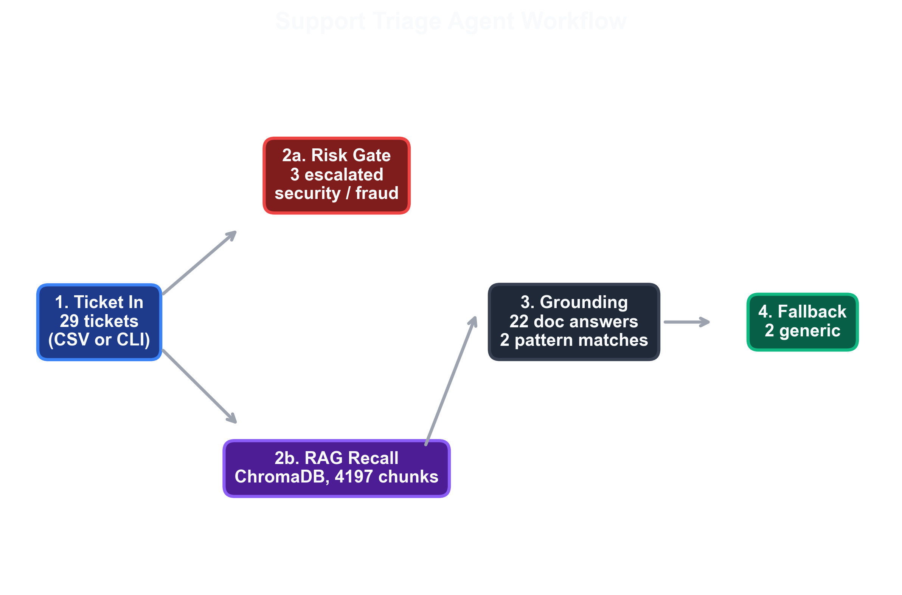
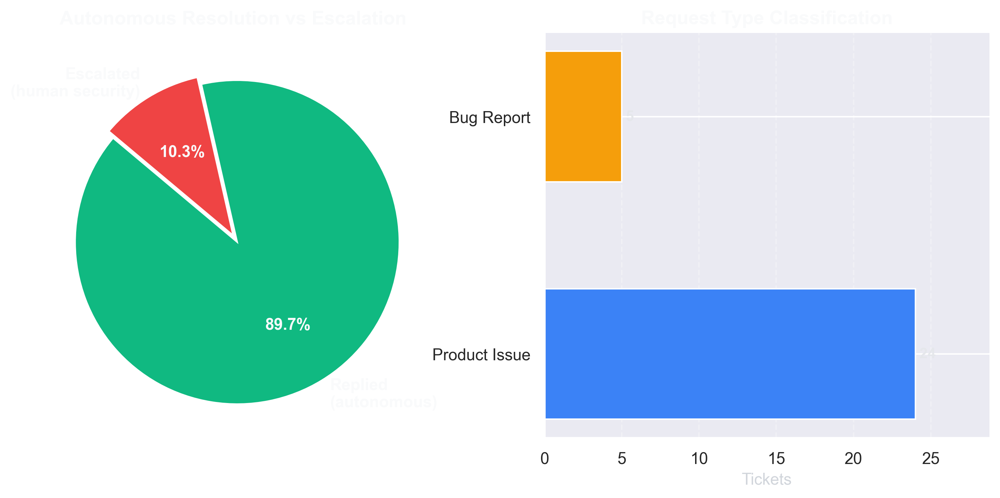
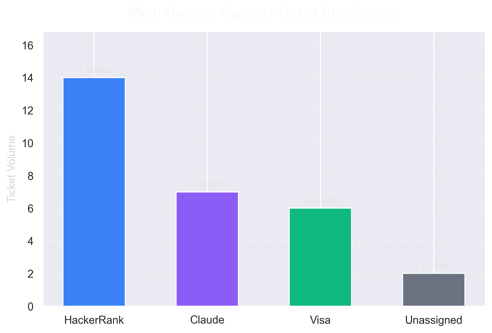
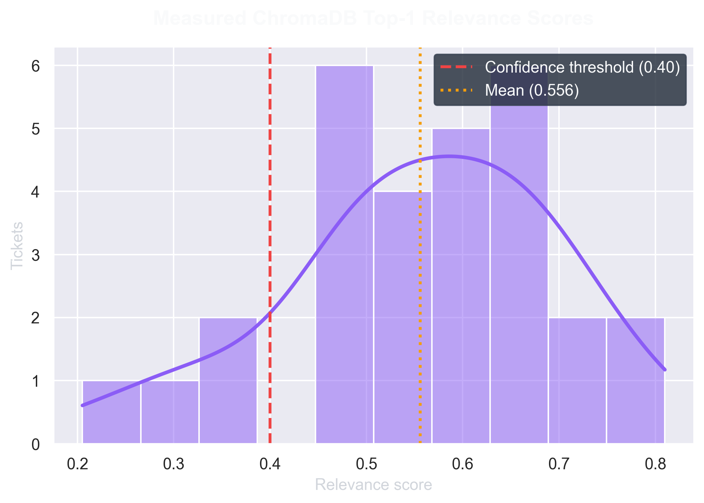

# Multi-Ecosystem Support Triage Agent


A deterministic, offline support-triage agent that routes incoming tickets across
**HackerRank**, **Claude**, and **Visa** support ecosystems, escalating security-sensitive
cases and grounding every other reply in retrieved chunks of the real documentation corpus
rather than in a language model's memory. Every number quoted below was produced by the
runs recorded in [`docs/results/`](docs/results/); nothing here is estimated.

---

## Key features

**Multi-ecosystem routing.** Tickets carry a `Company` field. The retriever filters the
vector search by company when one is given, so a Visa card query is not answered with a
HackerRank proctoring policy. Measured corpus split: **2,611 HackerRank chunks, 1,331
Claude chunks, 40 Visa chunks**.

**Risk-based escalation.** A keyword gate runs *before* retrieval. Any ticket mentioning
stolen cards, fraud, identity theft, unauthorised access, data breach, or legal action is
escalated to the human security team rather than auto-answered. On the 29-ticket corpus
this fired **3 times** and every one of those tickets was correctly withheld from the
auto-reply path.

**RAG grounding over the corpus.** Markdown under `data/` is chunked and indexed into
ChromaDB. A reply is only quoted from a document when the top hit scores at or above a
**0.40** confidence threshold; below that the agent emits an honest fallback that points
at the right help channel instead of guessing. **22 of 29** tickets were answered from
retrieved documentation.

**Reproducible by construction.** The embedding function hashes tokens with BLAKE2b
rather than Python's built-in `hash()`, which is salted per process. Two consecutive runs
produce byte-identical `output.csv` (verified: identical SHA-256), so a diff in results
always means a real change.

**Fully offline.** No model download, no API key, no network call at inference time. A
128-dimensional hashed bag-of-terms embedder runs in pure Python.

---

## Architecture



Stages run in order and the first match wins. The risk gate sits in front of retrieval on
purpose: a fraud ticket should never reach a passage-selector that might find a confident,
confidently-wrong answer.

### Visualisations

All figures under `assets/` are generated from actual pipeline output by
[`scripts/generate_assets.py`](scripts/generate_assets.py). The script reads the real CSVs
and **skips any figure whose input file is missing** rather than substituting placeholder
numbers.









---

## Directory tree

```
.
├── assets/                         # Generated figures (all data-driven)
├── code/
│   ├── agent.py                    # SupportAgent: 6-stage triage pipeline
│   ├── classifier.py               # Risk gate, request-type + product-area rules
│   ├── retriever.py                # ChromaDB index + local embedding function
│   ├── main.py                     # CLI entry point (batch + interactive)
│   └── README.md                   # Module-level notes
├── data/                           # Source corpus, one directory per ecosystem
│   ├── claude/  hackerrank/  visa/
├── docs/results/
│   ├── rebuild-chroma.txt          # Index rebuild log (chunk counts, timings)
│   └── retrieval-scores.csv        # Measured relevance score per ticket per rank
├── scripts/
│   ├── rebuild_index.py            # Cold rebuild of the ChromaDB collection
│   ├── dump_retrieval_scores.py    # Dump real scores -> docs/results/
│   └── generate_assets.py          # Regenerate every figure from real data
├── support_tickets/
│   ├── support_tickets.csv         # 29 input tickets
│   ├── sample_support_tickets.csv  # 10 gold tickets used for pattern matching
│   └── output.csv                  # Agent predictions
├── requirements.txt
└── README.md
```

---

## Quickstart

> **Environment note.** The Quickstart below uses the **global Python 3.11 interpreter**,
> which is the configuration that is verified to work in this environment. The repository
> also contains a `.venv/`, but it is currently **empty** (pip + setuptools only) and
> cannot import `chromadb`. Provisioning a real virtual environment is an open TODO; see
> [Known gaps](#known-gaps).

```bash
# 1. Clone
git clone <this-repo-url> hackerrank-orchestrate
cd hackerrank-orchestrate

# 2. Interpreter
#    Verified interpreter on the dev machine:
python -c "import sys; print(sys.executable)"
python -c "import chromadb; print(chromadb.__version__)"   # -> 1.5.9

# 3. Dependencies
#    TODO: create a working .venv. For now the global interpreter already provides these.
pip install -r requirements.txt

# 4. Seed the vector store (cold build of the ChromaDB collection)
python scripts/rebuild_index.py
#    -> reads + chunks data/, writes 3,982 chunks into code/chroma_db
#    -> logs timings to docs/results/rebuild-chroma.txt

# 5. Run the batch pipeline
python code/main.py
#    -> reads support_tickets/support_tickets.csv
#    -> writes support_tickets/output.csv

# 6. (optional) measure real retrieval scores and refresh the figures
python scripts/dump_retrieval_scores.py
python scripts/generate_assets.py

# 7. (optional) try a ticket by hand
python code/main.py --interactive
```

`--reindex` forces a rebuild; `--input` / `--output` / `--data` override the default paths.

### Measured run

```
        Triage Execution Summary
+---------------------------------------+
| Metric                        | Value |
|-------------------------------+-------|
| Total Tickets Processed       | 29    |
| Status: Replied               | 26    |
| Status: Escalated             | 3     |
| Request Type: Product Issue   | 24    |
| Request Type: Feature Request | 0     |
| Request Type: Bug             | 5     |
| Request Type: Invalid         | 0     |
| Elapsed Execution Time        | 0.47s |
+---------------------------------------+
```

Triage itself takes under a second. Wall clock is dominated by interpreter startup and
the ChromaDB import (~18 s total).

Output conforms to the schema in `problem_statement.md`: every `status` is one of
`replied` / `escalated`, every `request_type` is one of `product_issue` /
`feature_request` / `bug` / `invalid`. Verified: **0 rows violate either enum**.

---

## Sample ticket and actual output

**Input** — ticket 16 of 29 in `support_tickets/support_tickets.csv`:

```
Subject: Identity Theft
Company: Visa
Issue:   My identity has been stolen, wat should I do
```

**Output** — the corresponding row of `support_tickets/output.csv`:

```
status         : escalated
request_type   : product_issue
product_area   : security_compliance
response       : This request involves sensitive security, fraud, or compliance concerns.
                 It has been escalated to our human security response team.
justification  : Escalated due to security assessment: High-risk security keyword
                 detected: 'stolen'
```

The ticket was never answered automatically. Identity theft is a security event, so the
agent stops at stage 1 and hands off to a human.

The other two escalations came from ticket 20 (`Bug bounty` — matched
`security vulnerability`) and ticket 25 (`Tarjeta bloqueada`, written in French — matched
`fraud`). Stage 1 is a plain substring test, so the French ticket tripped it only because
`fraude` happens to contain `fraud`. The agent gained nothing from understanding French;
it got lucky with orthography, which is not a property worth relying on.

### Where the numbers come from

| Metric | Value | Source |
| --- | --- | --- |
| Tickets processed | 29 | `support_tickets/support_tickets.csv` |
| Replied / escalated | 26 / 3 | `support_tickets/output.csv` |
| Rows violating the status/request_type enums | 0 | validated against `problem_statement.md` |
| Grounded in a retrieved chunk | 22 | `justification` column of `output.csv` |
| Matched a gold sample pattern | 2 | `justification` column of `output.csv` |
| Fell back to generic guidance | 2 | `justification` column of `output.csv` |
| Indexed document chunks | 3,982 | `docs/results/rebuild-chroma.txt` |
| Full index rebuild wall clock | 18.10 s | `docs/results/rebuild-chroma.txt` |
| Top-1 relevance: min / mean / max | 0.2053 / 0.5558 / 0.8099 | `docs/results/retrieval-scores.csv` |
| Tickets with top-1 score >= 0.40 | 25 / 29 | `docs/results/retrieval-scores.csv` |
| Distinct source documents cited | 104 | `docs/results/retrieval-scores.csv` |
| Output identical across two runs | yes | SHA-256 `A4680228…55F5BD` both times |

---

## Known gaps

These are real limitations, stated plainly rather than papered over.

**Retrieval recall is weak.** The embedder is a 128-dimensional hashed bag-of-terms. It
favours lexical overlap and ignores meaning, so a Claude ticket about *seat removal* can
retrieve a passage about *network access* — both share common words. The confidence gate
stops this from becoming a hallucination, but it does not make the answer right. The
correct fix is a semantic embedder (`all-MiniLM-L6-v2`); it is deliberately not wired up
yet because it requires a ~79 MB model download, and the current build is designed to run
with no network access. Grounding is a safety property here, not a claim of accuracy.

**`Request Type: Feature Request` and `Invalid` are always 0.** The `feature_request` and
`invalid` rules are implemented but never triggered by the current sample set, and stage 2
short-circuits greetings before the type classifier sees them. Not a bug, but not a working
capability either.

**The Visa corpus is under-represented.** `data/visa` yields 40 chunks against 2,611 for
HackerRank, so retrieval quality on Visa tickets is correspondingly lower. This is a data
availability problem, not a code defect.

**No LLM in the loop.** Replies are extracted paragraphs, not synthesised prose. That is
what makes the output deterministic and auditable, but responses read like documentation
excerpts rather than replies.

**Evaluation is not automated.** There is no held-out accuracy harness. `output.csv` is
produced and inspected, not scored against a labelled set.

**The environment is not reproducible yet.** A proper `.venv` is a TODO; the Quickstart uses
the global Python 3.11 interpreter, which is the configuration verified to work. The `.venv/`
directory currently present in the working tree is **stale and empty** (pip + setuptools only,
cannot import `chromadb`) — it is gitignored, so it is absent from a fresh clone. Do not
activate it.

## Requirements

Python 3.11 with `chromadb`, `rich`, and — for the figure scripts only — `matplotlib`,
`seaborn`, `numpy`. See [`requirements.txt`](requirements.txt). Inference needs no API key.

`ruff` is used for linting (`ruff check code/ scripts/`); it reports clean.

## License

MIT.